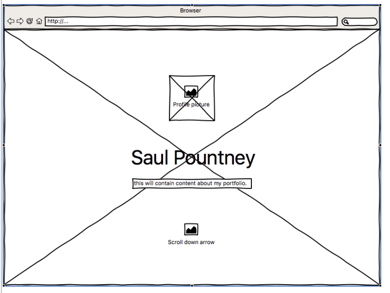
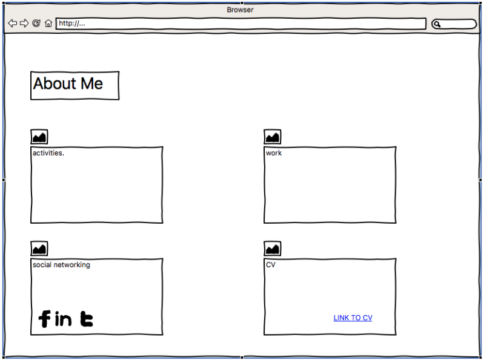
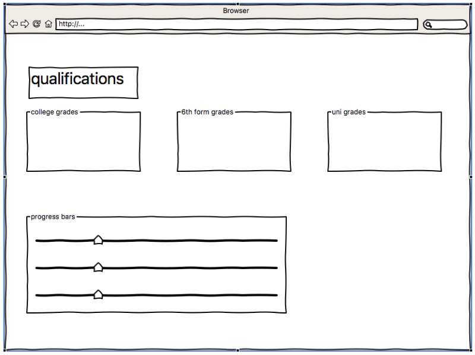
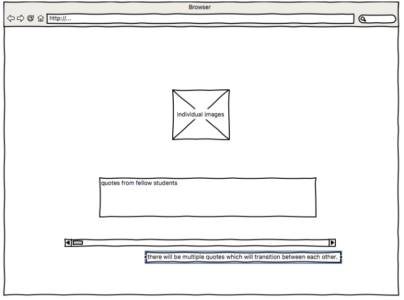
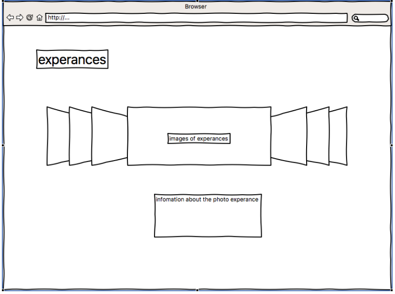
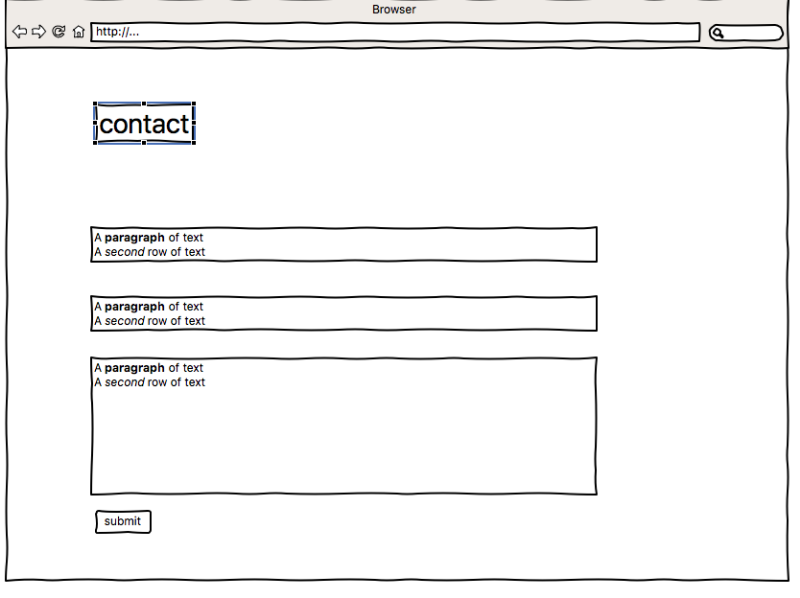

#++Front End Web Development++

###++Portfolio Website++
Student's P Number : P14182505  Module code : CTEC3905  Deadline: 10th March 2017

Please note that I had some issues with setting up the Git pages initially. I restarted my website as I accidentally deleted the wrong repositories however the completed website has not been effected by the time scaling problem.

####++Progress So Far++
All the pages have been commented on allowing for easy understanding of inline code. Complicated apects have been outlined in the code showing their purpose.

To begin the original design of the website outlined in the wireframes is a single page product. The objective of the build was to create a portfolio websites showing my experance in HTML, CSS and Javascript. The website also shows my current qualifications and experances which may effect my employability. My reasoning behind creating a portfolio website is because i have never built a website with myself being the subject of its creation. By challanging myself to creating a website i am unexperanced with i hope to show how my abilities and how i have progressed over the duration of the modual. As a challange i did not use bootstrap throughout this website as i believe that the code provided in the packages can be reproduced without relying on pre-written code. However i have used outside content such as awesome fonts and google api due to the the content they provide is Unique and add to the overall ambance of the website.

####++The Website++

When looking through the different browsers i found that for the best experance use Google Chrome. However it does work on other browsers.

++Header:++ I developed the header as a landing page for new visiters and added a paralax effect to the scrolling so that when different sections of the website appear it adds to the overall design. There is clear content outlineing the purpose of the website along with a picture of myself with a animated effect.

++About Me:++ I developed the aboutme page with content about me and linking social networks to the section id. i also added a download link to my CV so it can be printed in a hard copy format.

++Qualifications:++ I developed the qualifications page with content about my previous qualifications, i also added a progress table to show how near i am to completeing my university degree.

++Quote Area:++ I developed the quote page showing a trasition between different quotes from fellow students about their opinion of me.

++Experances:++ I developed the experance page by adding a gallery which shows different images of the places i have been that have had a fundemental effect on my person, when clicked the images lead to the full picture and content on how the place affected me.

++Contact:++ I developed the contact page by adding a contact area showing areas to imput email, name and a message.

++Footer:++ I developed the fotter of the website adding a small amout of centent of when it was created and the name of the creator.

####++Changes++
++Responciveness:++ I developed the the entire website to work on mobile devices creating several breakpoints for different scetions within the singler page product. I also added navigation responcivness allowing for a differance experance when viewing in a smaller screen.

++Header:++ I developed the profile picture to animate when hovered over shoing some fun css manipulation.(Taught in class)

++Experances:++ I developed the gallery diffrently from the one outlined in the wireframs as the consepts changed due to feasability.

####++Future work++
++Contact:++ I want to develop the contact page so that it is actually linked to an email and the button will notify the user if submission is succsessful or not.

++Responciveness:++ i want to develop the breakpoint in the website to allow seamless transition between page sizes not just full screen and mobile devices.

####++Wireframe sketches++
#####++Header++

#####++AboutMe++

#####++Qualifications++

#####++Quote++

#####++Experances++

#####++Contact++
